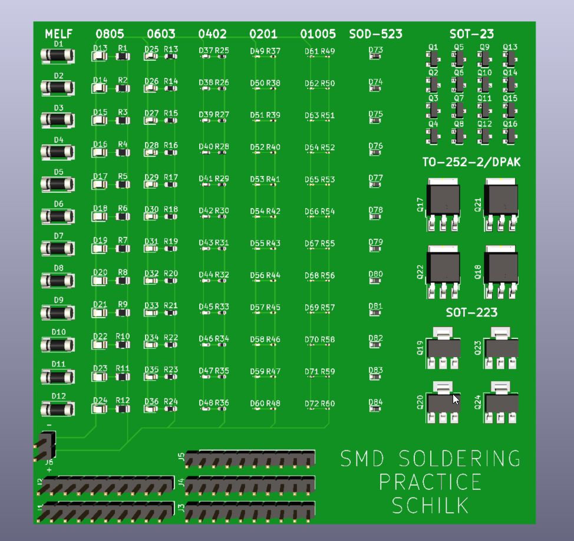
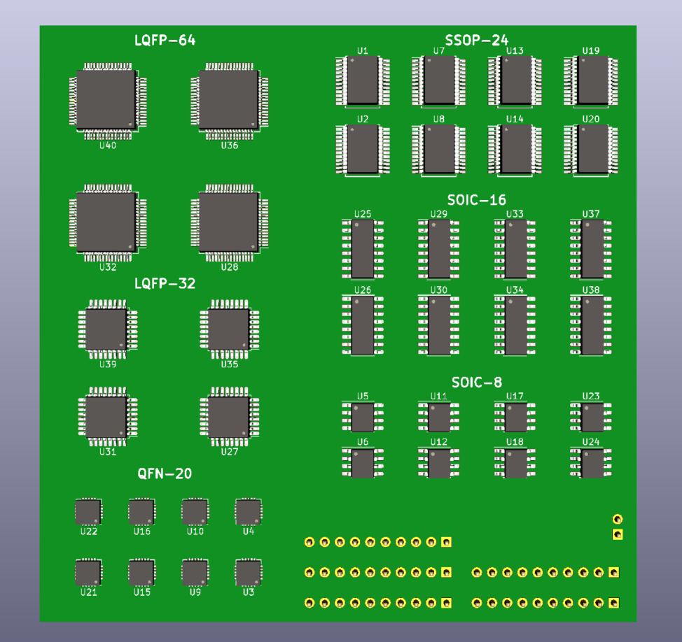

# SMD Solder Practice

### Philipp Schilk

A 100x100mm board with various SMD component footprints to practice SMD soldering.

## Components:

| Footprint 	| Count 	| KiCad Footprint 	|
|-	|-	|-	|
| MELF D 	| 12 	| Diode_SMD:D_MELF 	|
| 0805 R 	| 12 	| Resistor_SMD:R_0805_2012Metric 	|
| 0805 D 	| 12 	| LED_SMD:LED_0805_2012Metric 	|
| 0603 R 	| 12 	| Resistor_SMD:R_0603_1608Metric 	|
| 0603 D 	| 12 	| LED_SMD:LED_0603_1608Metric 	|
| 0402 R 	| 12 	| Resistor_SMD:R_0402_1005Metric 	|
| 0402 D 	| 12 	| LED_SMD:LED_0402_1005Metric 	|
| 0201 R 	| 12 	| Resistor_SMD:R_0201_0603Metric 	|
| 0201 D 	| 12 	| LED_SMD:LED_0201_0603Metric 	|
| 01005 R 	| 12 	| Resistor_SMD:R_01005_0402Metric 	|
| 01005 D 	| 12 	| LED_SMD:LED_01005_0402Metric 	|
| SOD-523 D 	| 12 	| Diode_SMD:D_SOD-523 	|
| SOT-23 	| 16 	| Package_TO_SOT_SMD:SOT-23 	|
| TO-252-2/DPAK 	| 4 	| Package_TO_SOT_SMD:TO-252-3_TabPin2 	|
| SOT-223 	| 4 	| Package_TO_SOT_SMD:SOT-223-3_TabPin2 	|
| SSOP-24 	| 8 	| Package_SO:SSOP-24_5.3x8.2mm_P0.65mm 	|
| QFN-20 	| 8 	| Package_DFN_QFN:QFN-20-1EP_4x4mm_P0.5mm_EP2.5x2.5mm 	|
| SOIC-8 	| 8 	| Package_SO:SOIC-8_3.9x4.9mm_P1.27mm 	|
| SOIC-16 	| 8 	| Package_SO:SOIC-16_3.9x9.9mm_P1.27mm 	|
| LQFP-32 	| 4 	| Package_QFP:LQFP-32_7x7mm_P0.8mm 	|
| LQFP-64 	| 4 	| Package_QFP:LQFP-64_10x10mm_P0.5mm 	|
| 10pin TH Header 	| 5 	| Connector_PinHeader_2.54mm:PinHeader_1x10_P2.54mm_Vertical 	